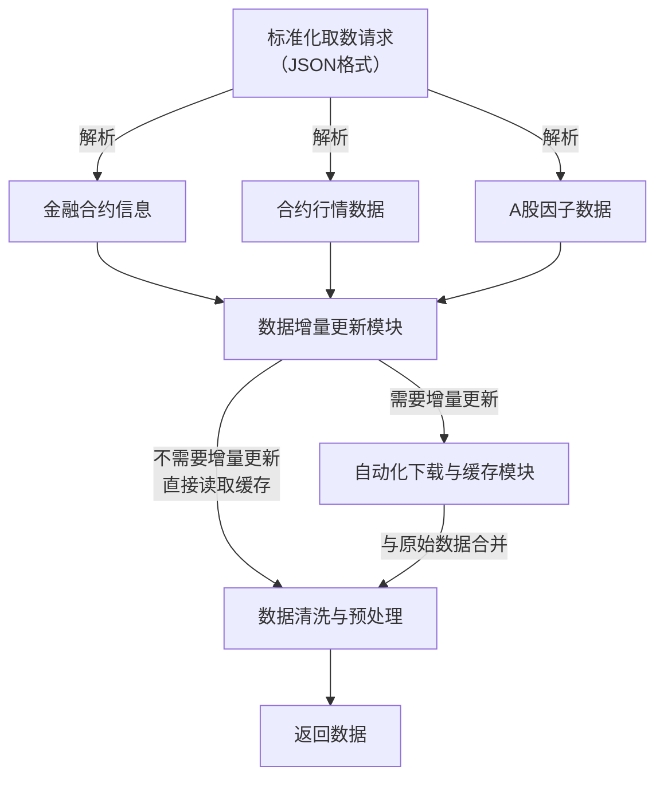
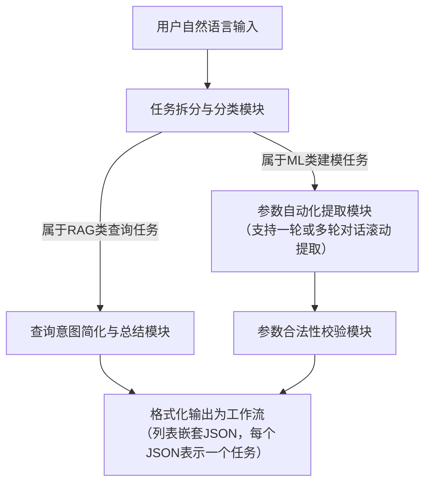
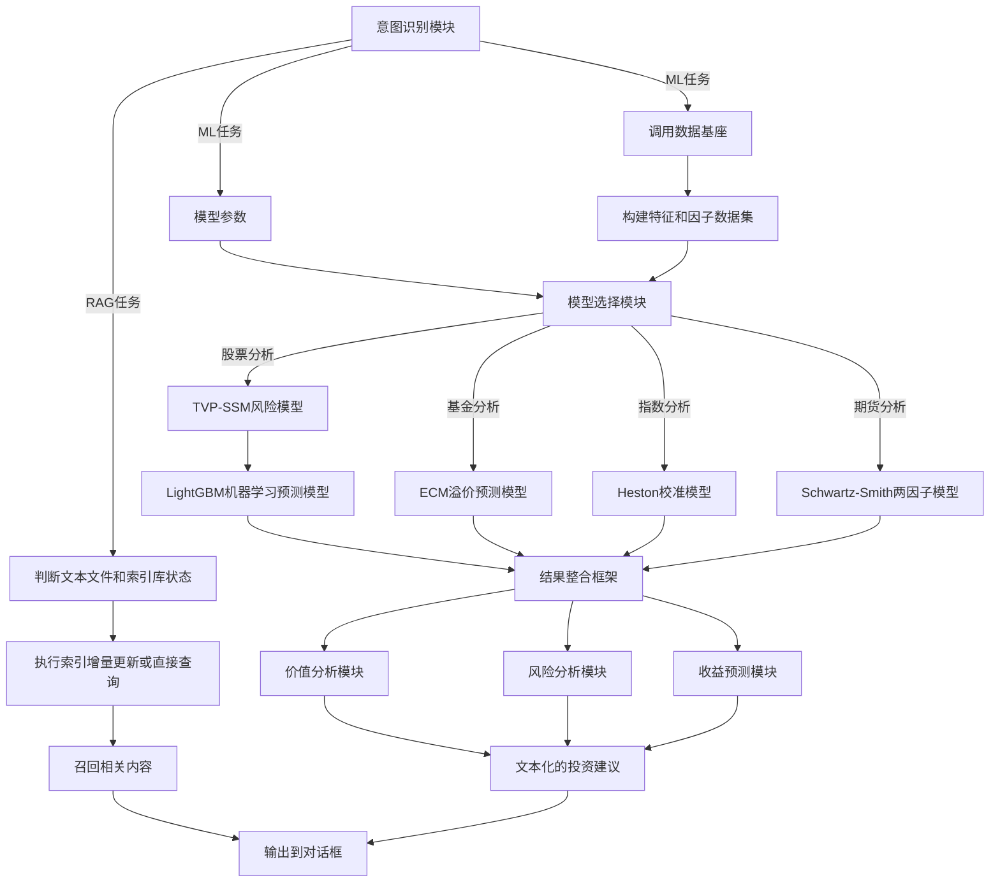

```mermaid
graph TD
    A[标准化取数请求\n（JSON格式）] --> |解析|F[金融合约信息]
    A[标准化取数请求\n（JSON格式）] --> |解析|G[合约行情数据]
    A[标准化取数请求\n（JSON格式）] --> |解析|H[A股因子数据]
    F --> C[数据增量更新模块]
    G --> C[数据增量更新模块]
    H --> C[数据增量更新模块]
    C --> |需要增量更新|D[自动化下载与缓存模块]
    C --> |不需要增量更新\n直接读取缓存|E[数据清洗与预处理]
    D --> |与原始数据合并|E[数据清洗与预处理]
    E --> I[返回数据]
```

```mermaid
graph TD
    A[用户自然语言输入] --> B[任务拆分与分类模块]
    B[任务拆分与分类模块] --> |属于ML类建模任务|C[参数自动化提取模块\n（支持一轮或多轮对话滚动提取）]
    B[任务拆分与分类模块] --> |属于RAG类查询任务|D[查询意图简化与总结模块]
    C[参数自动化提取模块\n（支持一轮或多轮对话滚动提取）] --> E[参数合法性校验模块]
    D[查询意图简化与总结模块] --> F[格式化输出为工作流\n（列表嵌套JSON，每个JSON表示一个任务）]
 	E[参数合法性校验模块] --> F[格式化输出为工作流\n（列表嵌套JSON，每个JSON表示一个任务）]
```

```mermaid
graph TD
    N[意图识别模块] --> |ML任务|P[模型参数] --> B[模型选择模块]  
    N[意图识别模块] --> |ML任务|M[调用数据基座] --> O[构建特征和因子数据集] --> B[模型选择模块]
	N[意图识别模块] --> |RAG任务|S[判断文本文件和索引库状态] --> T[执行索引增量更新或直接查询] --> U[召回相关内容] --> R[输出到对话框]
    B -->|股票分析| C[TVP-SSM风险模型] --> Q[LightGBM机器学习预测模型]
    B -->|基金分析| D[ECM溢价预测模型]
    B -->|指数分析| E[Heston校准模型]
    B -->|期货分析| F[Schwartz-Smith两因子模型]
    Q & D & E & F --> H[结果整合框架]
    H --> I[价值分析模块]
    H --> J[风险分析模块]
    H --> K[收益预测模块]
    I & J & K --> L[投资建议]
    L[文本化的投资建议] --> R[输出到对话框]
```

